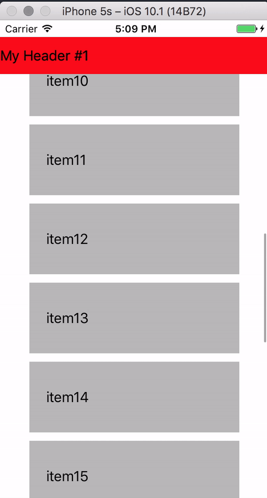

# LoadMoreSticky

This is a simple example project that exemplifies an UI glitch while performing a batch update in a UICollectionView that a has a Section Header pinned to the top.
If bounciness is enabled for the collectionView, the header jumps as shown in the video

